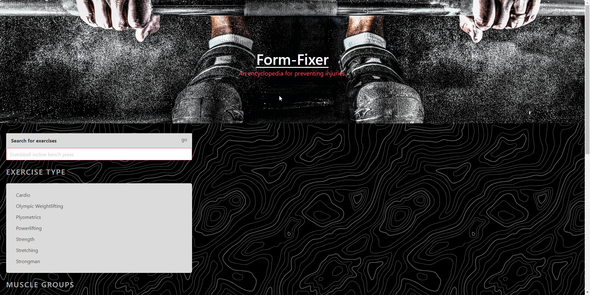

# project-1-group-6

### Andrew Wilson, Andrew Huynh, Lekendrick Mckeller, JD Person

---

Introducing Form Fixer, a comprehensive web application designed to provide users with a wealth of exercise instructions and tutorials. Whether you're a fitness enthusiast looking to diversify your workout routine or a beginner eager to learn the basics, Form Fixer offers a user-friendly platform with step-by-step demonstrations and detailed explanations for a wide range of exercises. With its lightweight library of workout instructions and turotials, Form Fixer is your ultimate companion for achieving your fitness goals and maintaining a healthy lifestyle.

### Features

---

- Exercise search function using localstorage to maintain prior queries

- Multiple query categories, for **Exercise Type**, **Muscle Groups**, and **Exercise Difficulty**

- Equipment information

- Detailed exercise instructions

- Demonstration video pulled from YouTube in a Modal window

- Responsive website layout

- Use of [Exercises API - API Ninjas](https://api-ninjas.com/api/exercises), [YouTube Video API](https://developers.google.com/youtube/v3/docs/videos), [Bulma CSS Framework](https://bulma.io/) and [jQuery JavaScript Library](https://jquery.com/)

### Screenshot

---

### Link to Deployed Application
---

[Form-Fixer](https://pingdrew.github.io/Form-Fixer/)

